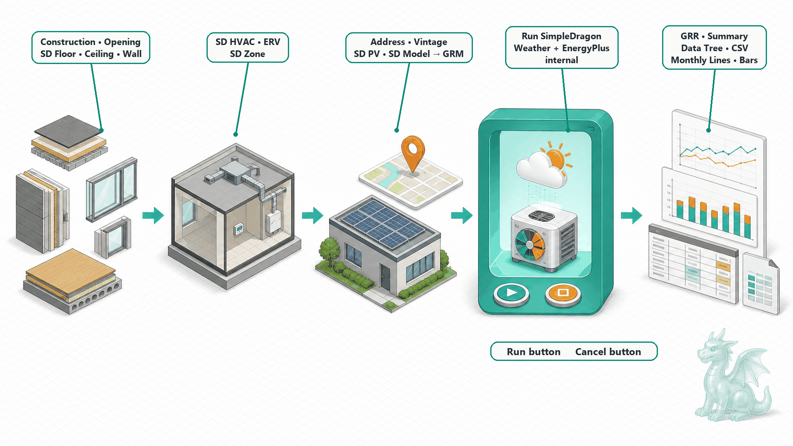
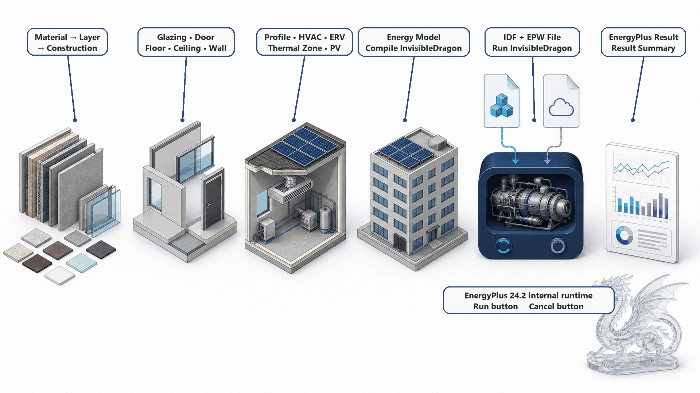

# Grasshopper workflow

This is the concise canvas-authoring guide for installed Dragon components.

## Shared conventions

- Numeric geometry and HVAC inputs use the SI units shown in each parameter description.
- In SimpleDragon, leave an optional capacity disconnected to preserve its
  unset/autosize meaning; zero is generally invalid there. In InvisibleDragon,
  several HVAC capacity and flow ports explicitly use `0` for autosize. Follow
  the description of the individual port.
- Entity and relationship IDs are generated deterministically inside both Dragon modules; they are not authoring inputs. Express ownership and references by connecting the typed objects instead of passing text IDs.
- Choose finite categories such as Boundary Condition from the named choices on the input. Integer enum codes are not part of the public authoring workflow.
- Item-access geometry inputs accept ordinary items, lists, or Data Trees. Grasshopper vectorizes the component and preserves branch paths; ownership-list inputs such as Zone Surfaces consume their values branch by branch.
- Red runtime messages stop that component's output. Warnings describe a usable result that needs review.
- Connect a momentary Grasshopper Button to every action input: Run, Cancel,
  Managed Batch Run/Cancel, Write GRM, Write GRR, and Export CSV. Pressing a
  Button supplies one bounded Boolean pulse and then returns to its resting
  False value. Use Toggles only for persistent options such as Force Rerun and
  Overwrite; they do not launch an action by themselves.

## SimpleDragon canvas groups

The SimpleDragon tab is organized by the stage and purpose of each component:

| Group | Components and purpose |
|---|---|
| Construction | Opaque materials, layers, and surface/fenestration constructions |
| Geometry | Window, Door, Glass Door, Floor, Ceiling, Wall, and Zone ownership |
| Model | Usage Profile selection, model assembly, HVAC sources and terminals, ERV, and PV |
| Simulation | Direct Run, GRM/GRR read and write, CSV export, Batch Case, and Managed Batch |
| Analysis | Model/GRR summaries, result Data Trees, and monthly line/bar plots |

`SD Profile` uses a native choice selector on its Name input. Choose the
packaged usage profile directly on the component and connect Profile to the
owning Zone; a text Panel round trip is not part of the workflow.

## Canonical SimpleDragon graph

Build each object where its ownership is visible in the wires:

*Figure: The canonical SimpleDragon graph keeps ownership local and the simulation boundary short.*

Choose `SD Window`, `SD Door`, or `SD GlassDoor`. Each component fixes the
opening type without a Type input and has no Zone Index or Face Index. Its
Construction input is required and belongs to the
completed Opening: Window and GlassDoor require a transparent construction and
optionally accept a Blind, while Door requires an opaque construction and has
no Blind input. Connect that Opening only to its owning `SD Wall`, `SD Ceiling`,
or `SD Floor`--normally `SD Wall`.

There is likewise no generic public `SD Surface` authoring component or Type
input: the selected component fixes the surface type. Each output Surface owns
one planar single-face Brep, opaque Construction, named Boundary Condition, and
its Openings. `SD Ceiling` also exposes optional cool-roof reflectance. Floor
defaults to Ground; Wall and Ceiling default to Outdoors. The opening curve
must be coplanar with and contained by that face; a trimmed inner loop needs a
matching explicit Opening rather than guessed metadata.

A Floor, Ceiling, or Wall Face input may receive a list or tree. The component
creates one typed Surface for each face and preserves its path. Combine the
completed typed outputs into one Surfaces branch for each enclosure; `SD Zone`
then creates one Zone from each branch-local owned list. Openings are also a
branch-local ownership list. A practical graph therefore sends opening-free
walls through one list while keeping each opening-bearing wall separate, unless
the tree paths deliberately match openings to hosts. This prevents an Opening
list from being broadcast to unrelated faces.

Connect the completed Surfaces of one closed thermal enclosure to `SD Zone`.
The Zone owns only those Surfaces plus its Name, Floor Number, positive Height,
Profile, lighting density, HVAC, and ERVs; it has no Brep, Construction,
Boundary, or Opening input. Connect each Zone-owned supply system and `SD ERV`
only to that Zone. Set the ERV's Count input when a Zone has multiple identical
units; no intermediate assignment component is involved.

`SD Model` resolves every Zone together. Coincident opposite Surfaces with
the Outdoors Boundary Condition in different Zones are promoted to reciprocal Zone boundaries
automatically. The Model also derives the material, construction,
supply, source, and ventilation catalogs from the connected objects, so those
catalogs need no parallel wires into a later assembly component.

Connect the GRM to `SD Model Summary` when you need derived model information.
It exposes floor area, typed exterior envelope/opening lists, weighted U-values,
infiltration at 50 Pa, lighting power density, and resolved climate metadata.
The authoring component itself stays compact. Rhino source provenance remains
inside the typed GRM/GRR wire and reaches CSV Export automatically.

Build each opaque construction from `Construction Layer` values. Each layer owns
its Material and Thickness, and the construction receives one ordered Layers
list; Materials and Thicknesses are never matched by list position.

The model Address and Vintage select the weather record. Connect the completed
GRM directly to `Run SimpleDragon`; connect Grasshopper Buttons to Run and
Cancel, and use Force Rerun and Timeout as options. Optionally connect a
user-owned `.grr` or JSON destination to `GRR Path`; leave it blank to return
the GRR without writing a file. The component internally converts the GRM, generates the
EnergyPlus 24.2 IDF, verifies the matching packaged EPW, resolves the supported
runtime, executes EnergyPlus, and constructs the GRR. Its public outputs are
only GRR, State, Success, and Diagnostics.

Let the definition solve once with the Run and Cancel Buttons at their resting
False value, then press the required Button to request one action. An identical
model/weather/timeout combination reuses the last GRR unless Force Rerun is
enabled. A Run pulse also writes a newly completed or cached result when GRR
Path is set; changing the path or recomputing the document does not write by
itself. Opening or recomputing a saved document never prepares weather or starts
EnergyPlus by itself.

## Standalone InvisibleDragon boundary

Low-level authoring uses the same local-ownership rule:

*Figure: Standalone InvisibleDragon exposes the model, IDF, and weather boundary while keeping runtime paths internal.*

Here `ID` is the InvisibleDragon component prefix, not an identifier input.

Choose `ID Window`, `ID Door`, or `ID GlassDoor`. `ID Window` and `ID
GlassDoor` accept Glazing, while `ID Door` accepts an opaque Construction. The
components have no Type or Blind input. InvisibleDragon's low-level domain
distinguishes only Window and Door, so `ID GlassDoor` follows the same
transparent Window domain route as `ID Window`.

Connect each completed Opening to its owning `ID Wall`, `ID Ceiling`, or `ID
Floor`; connect the completed typed Surface outputs and systems to their owning
Zone, and only completed Zone definitions to the Model. `ID Floor`, `ID
Ceiling`, and `ID Wall` fix the surface type and expose a named Boundary
Condition choice instead of integer Type or Boundary inputs. Floor defaults to
Ground; Wall and Ceiling default to Outdoors. Their curve inputs also vectorize
lists and trees, preserve paths, and feed each Zone as a branch-local Surface
list. Coincident, opposite-facing Surfaces with the Outdoors Boundary Condition
in different Zones are paired automatically into reciprocal inter-zone
boundaries. The Model derives HVAC assignments and nested sources from the Zone
wires, so there are no Zone indices, adjacent-surface IDs, source catalogs, or
assignment components on the canvas. Material, geometry, profile, Zone, HVAC,
ERV, and PV components also generate their entity IDs internally; none exposes
a relationship-ID input.

Connect `ID Model -> Compile InvisibleDragon -> Run InvisibleDragon`.
The compiler has only a typed Model input and resolves the managed EnergyPlus
24.2 IDD or its embedded execution mapping internally. This visible low-level
compile path is useful when the author deliberately works in InvisibleDragon;
SimpleDragon does not expose it as an intermediate stage.

For the second runner input, connect
`EPW File -> Verify InvisibleDragon Weather -> Run InvisibleDragon`.
`ID Weather` verifies the deliberately selected local EPW and emits a typed,
content-addressed Weather handle. An empty EPW File parameter is a safe no-op,
so a saved example can show the complete topology without reading a path.
InvisibleDragon does not select, download, or infer weather.

`Run InvisibleDragon` remains the low-level executor for this explicit workflow.
It is not inserted between `SD Model` and `Run SimpleDragon`, and none of its
ports is required on a SimpleDragon canvas.

EnergyPlus, Energy+.idd, runtime caches, working directories, and cleanup are
module-owned. SimpleDragon also owns its packaged weather cache. A standalone
InvisibleDragon EPW stays at the user-selected location and is verified before
execution; simulations use the operating-system temp directory. Nothing writes
below the Rhino installation directory, and no administrator permission is
required.

## Simulation and analysis

The Simulation group contains execution and result-artifact operations; the
Analysis group contains non-writing model/result inspection and plots. `Run
SimpleDragon` emits the completed GRR directly. Summary, DataTree, line-plot,
and bar-plot components expose the same ordered month, fuel, and end-use data
without an InvisibleDragon-result handoff or file round trip.
Their result trees append series indices to the incoming GRR path instead of
collapsing separate branches.

For an immediate Rhino preview, connect GRR to `Monthly Lines` or `Monthly
Bars` and leave every other input alone. The defaults draw SiteUses per area,
grouped by fuel, on a 12 x 6 World XY frame; the bar variant defaults to grouped
bars. Before Run has produced a GRR, these result components simply wait without
raising a red error. Metric, grouping, plane, size, and stacking remain optional
controls for a customized graph.

A direct `Run SimpleDragon` or `Run InvisibleDragon` component owns one
asynchronous simulation state and therefore accepts one data-matched run. For a
SimpleDragon model list or tree, use Batch Case and Managed Batch; for separate
low-level InvisibleDragon simulations, use one Run component per simulation.

Run's optional GRR Path, GRM/GRR readers and writers, and CSV export intentionally
expose artifact destinations because those are user-owned results, not simulation
setup. Relative output paths use the saved Grasshopper document folder; unsaved
definitions fall back to the per-user temp directory. Run creates a missing
parent directory and replaces an existing GRR destination. Use the separate
`Write GRR` component when saving an already available or rerouted result without
pressing Run. When a GRM is connected, CSV export derives its case identity from
that model rather than asking for a text ID.

Connect a Grasshopper Button to Write GRM, Write GRR, and Export CSV. Their
Boolean input is internally level-sensitive, so a Toggle left True could write
again on later solutions; the Button's momentary pulse bounds the operation to
the intended solution. Overwrite is a persistent option Toggle for Export, not
an action trigger.

Wrap each model in a `SimpleDragon Batch Case`, which derives a deterministic
case identity from the GRM, then connect the Cases list or tree to `Managed Run
SimpleDragon Batch` with a parallel limit and explicit Run/Cancel controls. The
runner consumes the complete tree as one batch and preserves its paths in the
Case IDs and Statuses outputs. It selects packaged weather from each model's
Address/Vintage and manages EnergyPlus/runtime/temp paths internally. Combined
CSV and reproducibility-manifest paths are outputs only.

## Runnable examples

The tracked definitions under `examples/` progress from materials and profiles to linked Rhino geometry and a complete two-zone simulation. The principal authoring examples are:

- `12-simpledragon-two-zone-model.gh`: the complex authoring demonstration,
  with named face Breps authored through explicit Floor, Ceiling, and Wall
  components, opening-free walls grouped as lists, opening-bearing walls kept
  separate, and each Zone owning one Surface branch; terminal systems and ERVs
  remain directly owned by their Zones;
  a heat-pump/AHU serves the west Zone, a boiler/radiator serves the east Zone,
  and PV is resolved with both into one complete GRM and Model Summary;
- `14-simpledragon-two-zone-run-results-csv.gh`: the stable end-to-end example,
  with an electric radiator and ERV connected directly to each Zone,
  `SD Model -> Run SimpleDragon -> GRR`, a directly connected default monthly
  line graph, summaries, CSV, and a typed Batch Case feeding the managed batch
  runner.

`02-invisibledragon-single-zone-hvac-idf.gh` shows the complete standalone
low-level topology: authoring, path-free compile, explicit EPW verification,
and `Run InvisibleDragon`. Its EPW File parameter contains no data and all
action Buttons rest at False, so choose an EPW and press Run only when execution
is intended.

The geometry is also available as `30-two-zone-office.3dm` and `31-three-zone-stepped-office.3dm`. All action Buttons are saved at their resting False value.

Open the tracked definitions from the [examples directory](../../examples/README.md).
Each action Button is saved unpressed, so opening an example does not start a
simulation or write a file.

## Saving and reopening

Dragon Goo stores deterministic, schema-versioned snapshots in the Grasshopper
document. Opening and Surface definitions include their geometry; Zone
snapshots include their owned Surface definitions and Zone-level values.
Model, HVAC, and result values also survive save and reopen.
